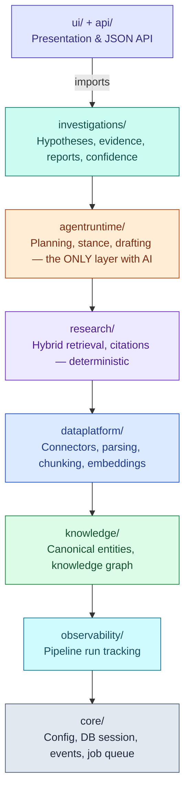
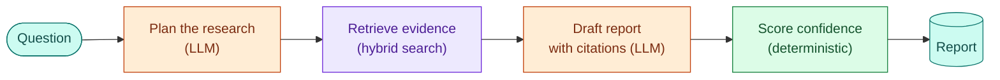

# Argus — Enterprise Research Operating System

Argus continuously ingests financial knowledge from public sources, structures it into a
canonical, graph-linked knowledge platform, and assists institutional research through
evidence-based investigations — persistent, reproducible research artifacts with complete
provenance, never chat sessions.

Argus is **not** a chatbot, a PDF-RAG demo, a trading system, or an investment advisor.
It is knowledge infrastructure that AI consumes; generated text is never a source of truth.

## Why this project exists

Enterprise AI is a systems engineering problem, not an LLM problem. Argus demonstrates the
architecture behind institutional research platforms: deterministic ingestion pipelines,
entity resolution against canonical IDs, hybrid retrieval, a provenance-carrying knowledge
graph, reproducible AI-assisted investigations — and the engineering discipline
(idempotency, immutability, observability, replayable events) that production systems need.

## Architecture at a glance



One Postgres-backed modular monolith, one-way imports top to bottom, AI confined to a single
layer. Full detail — including the ingestion pipeline, investigation lifecycle, schema, and
security model, all as diagrams — is in [docs/ARCHITECTURE.md](docs/ARCHITECTURE.md).

**How a research question becomes a cited answer:**



Every claim in the report resolves back to a chunk of a real, ingested document — evidence
without a citation is rejected before it ever reaches the report.

## Documentation

**New to the codebase? Start with [docs/ONBOARDING.md](docs/ONBOARDING.md)** — a guided
walkthrough written for a developer joining the project for the first time.

| Document | Purpose |
|---|---|
| [docs/ONBOARDING.md](docs/ONBOARDING.md) | Start here: setup, guided tour, glossary, "where do I change X?" |
| [docs/DESIGN_BIBLE.md](docs/DESIGN_BIBLE.md) | Governing principles; every ADR references it |
| [docs/PRD.md](docs/PRD.md) | Product requirements, users, MVP scope |
| [docs/ARCHITECTURE.md](docs/ARCHITECTURE.md) | The layers, storage design, AI boundary — with diagrams |
| [docs/DOMAIN_MODEL.md](docs/DOMAIN_MODEL.md) | Object catalog + entity-relationship diagram |
| [docs/RISKS.md](docs/RISKS.md) | PRD risks mapped to design mitigations |
| [docs/adr/](docs/adr/) | Architecture Decision Records with tradeoffs and upgrade paths |

## Quickstart

Requires: Python 3.12+, [uv](https://docs.astral.sh/uv/), Docker.

```bash
cp .env.example .env
make up        # Postgres 16 + pgvector via docker compose
make migrate   # apply database migrations
make test      # run the test suite
make lint      # ruff + layered-architecture contract
make worker    # run the pipeline worker + connector scheduler
make api       # run the API + UI (uvicorn --reload)
make stack     # build and run the full app (postgres + api + worker) in containers
make eval      # score retrieval and investigation quality against the golden set
make backup    # pg_dump + raw-store tarball into backups/
make restore   # restore from a backup: make restore DB_DUMP=... RAW_TGZ=...
```

## Status

V1 complete: all ten roadmap phases (Design Bible §22) are implemented — ingestion
pipeline, knowledge graph, hybrid retrieval, agent runtime, citation-gated investigations,
UI, containerized stack, and the eval framework. One item remains explicitly pending:
live end-to-end verification against a real LLM, which awaits `ARGUS_OPENROUTER_API_KEY`.
Everything else is verified against a deterministic fake adapter.

## What V1 deliberately excludes

Collaboration, permissions, proprietary connectors, real-time streaming, portfolio
optimization, multi-user organizations. Deferred infrastructure (Neo4j, Kafka, dedicated
vector DBs) is a documented decision with named upgrade triggers — see the ADRs.
