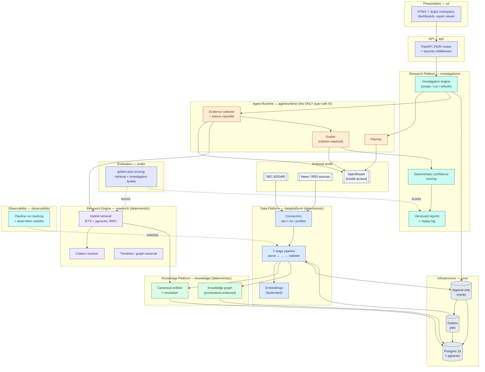
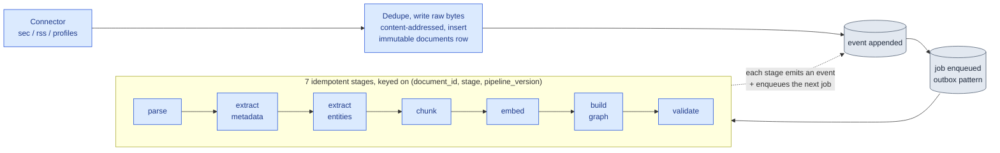
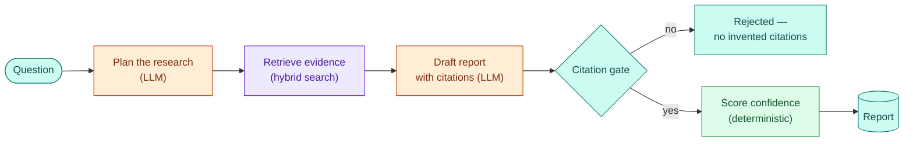

# Argus — Enterprise Research Operating System


Argus continuously ingests financial knowledge from public sources, structures it into a
canonical, graph-linked knowledge platform, and assists institutional research through
evidence-based investigations — persistent, reproducible research artifacts with complete
provenance, never chat sessions.

Argus is **not** a chatbot, a PDF-RAG demo, a trading system, or an investment advisor. It is
knowledge infrastructure that AI consumes; generated text is never a source of truth. Every
claim in every report resolves back to a chunk of a real, ingested document — evidence without
a citation is rejected before it ever reaches a report, and confidence in that report is a
computed number, not something the model says about itself.

## Why this project exists

Enterprise AI is a systems engineering problem, not an LLM problem. Anyone can wire a chatbot
to a vector store; the hard part — the part that actually determines whether a research
platform survives contact with a real institution — is everything underneath it: deterministic
ingestion pipelines that don't lose data, entity resolution against canonical IDs, hybrid
retrieval that doesn't hallucinate relevance, a knowledge graph where every edge carries
provenance, and an AI boundary narrow enough that a compliance team could actually audit it.

Argus is a from-scratch implementation of that architecture: the ingestion pipeline, the
knowledge platform, the retrieval engine, the citation-gated agent runtime, and the operational
discipline (idempotency, immutability, observability, replayable events, security hardening)
that separates production infrastructure from a weekend demo.

## By the numbers

| | |
|---|---|
| Enforced architectural layers (`import-linter`) | 10 |
| Deterministic ingestion pipeline stages | 7 |
| Test functions | 118, across 14 files |
| Architecture Decision Records | 9 |
| Hand-written schema migrations | 5 |
| Source under `src/argus/` | ~3,300 lines |
| Storage engines unified into one Postgres instance | 6 — relational, vector (pgvector/HNSW), full-text, graph (recursive CTEs), event log, job queue |

## Architecture

One modular monolith, one Postgres instance, one narrow AI boundary. Import direction is a
straight line — enforced by `import-linter` (`make lint`), not by convention — and every box
below maps to a real package under `src/argus/`.



## How it works

**Ingesting a document** — every source, every document, one deterministic path:



Crashed or stuck jobs are re-queued by a lease-based reaper; jobs that exhaust their retry
budget dead-letter visibly instead of vanishing. Full detail in
[docs/ARCHITECTURE.md](docs/ARCHITECTURE.md#5-event-driven-ingestion).

**Answering a research question** — every claim traces back to evidence, or the run fails:



Full detail, including the resolvable citation chain and the confidence formula, in
[docs/ARCHITECTURE.md](docs/ARCHITECTURE.md#3-the-ai-boundary).

## Engineering highlights

- **Documents are immutable.** Content columns are guarded by a database trigger; corrections
  arrive as new documents, never edits. Nothing downstream can silently rewrite history.
- **Events are append-only; jobs are a disposable outbox.** The `events` table is the one
  source of truth; `jobs` is derived from it and can be rebuilt from scratch at any time.
- **Every pipeline stage is idempotent and replayable.** Keyed on
  `(document_id, stage, pipeline_version)` — safe to re-run after a crash, and reprocessing
  never mutates a previous version.
- **AI never touches raw storage.** Confined to a single package (`agentruntime/`), enforced
  by `import-linter`, not by convention or code review discipline.
- **Uncited evidence is structurally rejected.** A drafted report that cites a chunk outside
  its own retrieved evidence set fails the run — no invented citations reach an analyst.
- **Confidence is computed, never generated.** A deterministic function of source diversity,
  document count, source quality, recency, and stance agreement — auditable, reproducible,
  and never something the model asserts about itself.
- **Hybrid retrieval, not vector-only.** Full-text and pgvector search fused with reciprocal
  rank fusion, under a versioned strategy so old and new scores are never silently conflated.
- **Full reproducibility.** Every investigation persists its retrieval parameters, model
  versions, and retrieved chunk IDs — replay an old investigation and get the same evidence.
- **Hardened by default.** Constant-time API-key comparison, per-IP rate limiting on the
  endpoint that spends LLM tokens, SSRF allowlisting on external fetches, capped request
  bodies, and a full set of security headers — see ADR-0009.
- **Observable failure, not silent failure.** Every stage attempt is recorded; poison jobs
  dead-letter visibly on a live dashboard instead of retrying forever or disappearing.

## Tech stack

| Technology | Role | Why this, not the obvious alternative |
|---|---|---|
| PostgreSQL 16 + pgvector | Relational, vector, full-text, graph (CTEs), event log, job queue — one database | [ADR-0002](docs/adr/0002-postgres-for-everything.md): one operationally simple store beats a five-system stack at this scale |
| FastAPI + sync SQLAlchemy 2.0 | HTTP API + ORM | [ADR-0004](docs/adr/0004-sync-first.md): sync-first — async adds complexity this I/O volume doesn't justify |
| Google ADK + LiteLLM via OpenRouter | Agent orchestration + model access | [ADR-0006](docs/adr/0006-openrouter-model-access.md): the model is an `ARGUS_LLM_MODEL` config value, never a code dependency |
| Events + outbox (no broker) | Ingestion backbone | [ADR-0003](docs/adr/0003-events-and-outbox.md): append-only log + `SKIP LOCKED` outbox instead of Kafka/Redis Streams |
| HTMX + Jinja2 | Server-rendered workspace UI | Enterprise software, not a chat widget; no SPA build step |
| Typer + rich | CLI (`argus status`, `search`, `worker`, `ingest`, `reprocess`, `retry-dead`, `eval`) | The operational surface for running and repairing the pipeline, with colorized human-facing output |
| Docker + docker-compose | Containerized stack (`make stack`) | Postgres + API + worker, one profile, reproducible environment |
| `import-linter` | Layer-boundary enforcement | [ADR-0001](docs/adr/0001-modular-monolith.md): a modular monolith with import direction enforced in tooling, not code review |

Every deferred piece of infrastructure (Neo4j, Kafka, a dedicated vector DB, multi-user auth,
…) is a documented decision with a concrete trigger to revisit it —
[ADR-0008](docs/adr/0008-deferred-capabilities.md).

## Documentation

**New to the codebase? Start with [docs/ONBOARDING.md](docs/ONBOARDING.md)** — a guided
walkthrough written for a developer joining the project for the first time. Everything below
is where to go deeper once you're past the basics.

| Document | Purpose |
|---|---|
| [docs/ONBOARDING.md](docs/ONBOARDING.md) | Start here: setup, guided tour, glossary, "where do I change X?" |
| [docs/DESIGN_BIBLE.md](docs/DESIGN_BIBLE.md) | Governing principles; every ADR references it |
| [docs/PRD.md](docs/PRD.md) | Product requirements, users, MVP scope |
| [docs/ARCHITECTURE.md](docs/ARCHITECTURE.md) | The layers, storage design, AI boundary — with diagrams |
| [docs/DOMAIN_MODEL.md](docs/DOMAIN_MODEL.md) | Object catalog + entity-relationship diagram |
| [docs/RISKS.md](docs/RISKS.md) | PRD risks mapped to design mitigations |
| [docs/adr/](docs/adr/) | Architecture Decision Records with tradeoffs and upgrade paths |

## Quickstart

Requires: Python 3.12+, [uv](https://docs.astral.sh/uv/), Docker.

```bash
cp .env.example .env
make up        # Postgres 16 + pgvector via docker compose
make migrate   # apply database migrations
make test      # run the test suite
make lint      # ruff + layered-architecture contract
make worker    # run the pipeline worker + connector scheduler
make api       # run the API + UI (uvicorn --reload)
make stack     # build and run the full app (postgres + api + worker) in containers
make eval      # score retrieval and investigation quality against the golden set
make backup    # pg_dump + raw-store tarball into backups/
make restore   # restore from a backup: make restore DB_DUMP=... RAW_TGZ=...
```

## CLI usage

`argus --help` lists every command with rich-rendered help. The operational surface:

```bash
argus status              # one-screen ops snapshot: job queue, dead jobs, documents, recent pipeline runs
argus search "query" -k 5 # hybrid search from the terminal, results as a table
argus ingest company_profiles   # run one connector pass now
argus reprocess --stage parse --pipeline-version 2   # re-derive artifacts, no re-downloading
argus retry-dead           # requeue dead-lettered jobs
argus eval retrieval       # score retrieval against evals/golden.json
argus eval investigation   # score investigation quality
argus worker               # run the pipeline worker + connector scheduler (plain JSON logs, for machines)
```

Every command above renders colorized, human-facing output (`rich` tables and themed
text); `worker` is the one exception — it keeps plain structured JSON logging, since it's
meant to be read by log aggregators, not a terminal.

## Status

V1 is feature-complete: all ten roadmap phases (Design Bible §22) are implemented and tested —
ingestion pipeline, knowledge graph, hybrid retrieval, agent runtime, citation-gated
investigations, UI, containerized stack, and the eval framework. One item remains explicitly
pending: live end-to-end verification against a real LLM, which awaits
`ARGUS_OPENROUTER_API_KEY`. Everything else is verified against a deterministic fake adapter.

## Deliberately out of scope for V1

Collaboration, permissions, proprietary connectors, real-time streaming, portfolio
optimization, multi-user organizations. Each deferred piece of infrastructure (Neo4j, Kafka,
dedicated vector DBs) is a documented decision with a named upgrade trigger, not an oversight —
see the ADRs.
