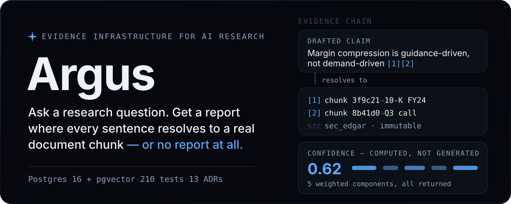
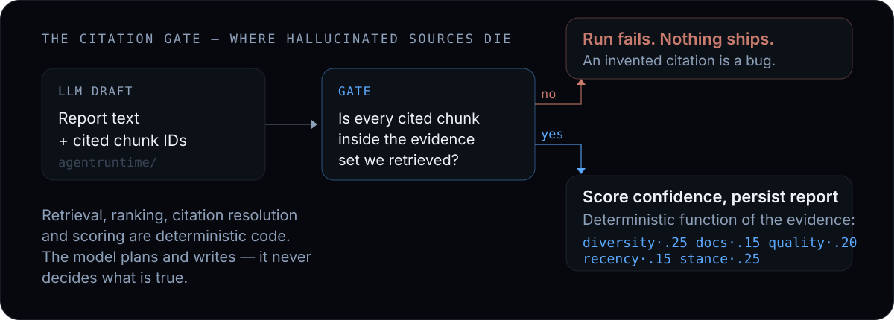
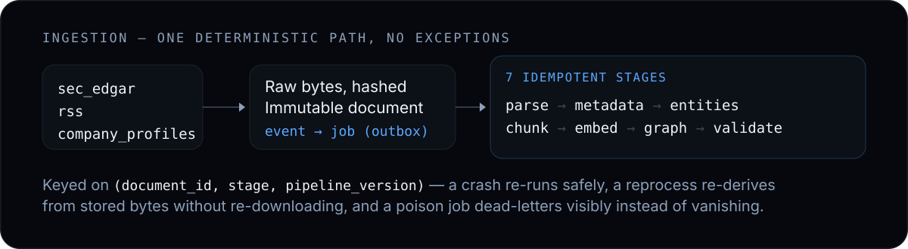
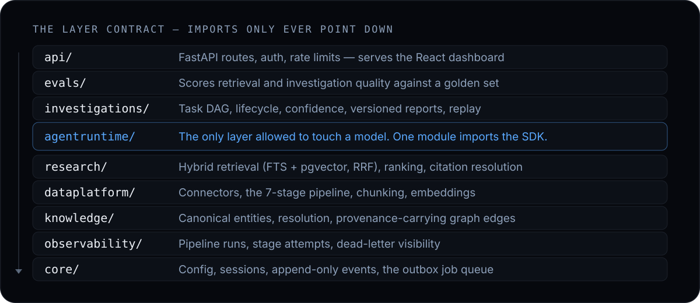

<p align="center">
  
</p>

<p align="center">
  
  
  
  
  
</p>

Argus ingests SEC filings and news, turns them into an immutable, graph-linked knowledge base,
and runs **investigations** on top of it. An investigation is a stored, replayable research
artifact: a citation behind every claim, and a confidence score you can recompute by hand.

The model plans and writes. It does not decide what is true.

## The question that breaks every AI research demo

Ask one of them where a sentence came from.

You get a plausible paragraph, a footnote pointing at a 300-page PDF, and a "confidence: high"
the model wrote about itself. On a research desk that is unusable. A claim you cannot trace is a
claim you cannot put in a memo, and you find out which sentence was invented after it ships.

Argus fails the run instead.

<p align="center">
  
</p>

Three rules do the work:

1. **Evidence without a chunk reference is rejected at the boundary.** A drafted report that
   cites anything outside its own retrieved evidence set fails the run.
2. **Confidence is computed, never generated.** It is a weighted function of source diversity,
   document count, source quality, recency and stance agreement, and every component comes back
   in the response ([`confidence.py`](src/argus/investigations/confidence.py)).
3. **Every investigation stores its retrieval parameters, model version and chunk IDs.** Replay
   one from six months ago and you get the same evidence back.

## The questions it's built to answer

| You ask | Argus answers with |
|---|---|
| *"Is this margin story guidance-driven or demand-driven?"* | Evidence from multiple sources, each with a stance (supporting / contradicting) and a resolvable chunk |
| *"What changed between the last two filings?"* | A timeline built from immutable documents, where a correction arrives as a new document instead of an edit |
| *"Who disagrees with this claim?"* | Contradicting evidence surfaced explicitly, and a confidence score that drops when sources disagree |
| *"Why should I believe this number?"* | Claim to chunk to document to source, one click each, down to the raw bytes on disk |
| *"Did anything break while I wasn't looking?"* | A dead-letter queue, per-stage attempt history, and a job that failed loudly instead of disappearing |

## How it works

**Ingestion.** One path for every source. Fetch, hash, store the raw bytes, insert an immutable
`documents` row, append an event. The event enqueues a job, and the job runs seven idempotent
stages.

<p align="center">
  
</p>

**Investigation.** A question becomes a task DAG. The orchestrator walks it, each task retrieves
its own evidence through deterministic hybrid search (Postgres full-text plus pgvector, fused
with reciprocal rank fusion), and the drafter writes only from what came back. The run itself is
a state machine: `created` to `running` to `complete`, with `paused`, `cancelled` and `archived`
as first-class states, so a human can interrupt a live investigation, annotate it, and resume.

**The layer contract.** This is why the codebase survives changes: imports only ever point down,
and one layer is allowed near a model.

<p align="center">
  
</p>

`make lint` fails the build if a single import crosses a layer the wrong way. It is a contract in
CI, not a code-review habit ([ADR-0001](docs/adr/0001-modular-monolith.md)).

## Run it

Requires Python 3.12+, [uv](https://docs.astral.sh/uv/), and Docker.

```bash
cp .env.example .env
make up        # Postgres 16 + pgvector
make migrate   # apply migrations
make api       # API + dashboard at :8000
make worker    # pipeline worker + connector scheduler (second terminal)
```

Then drive it from the terminal:

```bash
argus status                                   # job queue, dead jobs, documents, recent runs
argus search "supply chain exposure" -k 5      # hybrid search, as a table
argus ingest sec_edgar                         # run one connector pass now
argus reprocess --stage chunk --pipeline-version 2   # re-derive, no re-downloading
argus retry-dead                               # requeue poison jobs after you've fixed the cause
argus eval retrieval                           # score against evals/golden.json
```

`make test` (210 tests), `make lint` (ruff plus the layer contract), `make stack` (Postgres, API
and worker in containers), `make backup` / `make restore`. Every push runs the suite against a
real pgvector service in GitHub Actions.

## Why it's built this way

Boring infrastructure, on purpose. Each choice has a written trade-off and a trigger to revisit
it.

| Choice | Instead of | Reasoning |
|---|---|---|
| One Postgres 16 + pgvector: relational, vector, full-text, graph CTEs, event log, job queue | A five-system stack with a dedicated vector DB and Neo4j | [ADR-0002](docs/adr/0002-postgres-for-everything.md): one store you can back up, restore and reason about beats six you can't |
| Append-only events plus a `SKIP LOCKED` outbox | Kafka, Redis Streams, Celery | [ADR-0003](docs/adr/0003-events-and-outbox.md): the log is the source of truth, and the queue is derived and disposable |
| Sync SQLAlchemy, sync httpx, `def` endpoints | async everywhere | [ADR-0004](docs/adr/0004-sync-first.md): this I/O volume does not pay for the complexity |
| The model behind one adapter module, selected by config | An LLM SDK imported across the codebase | [ADR-0006](docs/adr/0006-openrouter-model-access.md): models are a config value with a six-month shelf life |
| Evidence-first AI boundary | Prompting the model to "cite your sources" | [ADR-0005](docs/adr/0005-evidence-first-ai-boundary.md): enforcement beats instruction |
| React SPA on a FastAPI backend | Server-rendered templates | [ADR-0013](docs/adr/0013-react-spa-dashboard.md): the DAG view and live timeline needed real client state |

Thirteen ADRs, seven hand-written migrations, about 4,500 lines under `src/argus/`. The things
deliberately left out (multi-user orgs, streaming, portfolio optimization, proprietary
connectors) are written decisions with an upgrade trigger, not oversights
([ADR-0008](docs/adr/0008-deferred-capabilities.md),
[ADR-0012](docs/adr/0012-v2-deferrals.md)).

## Where it stands

V1 is complete and hardened: ingestion, knowledge graph, hybrid retrieval, agent runtime,
citation-gated investigations, dashboard, containerized stack and eval harness, plus
constant-time API-key checks, per-IP rate limiting on the endpoint that spends tokens, SSRF
allowlisting and capped request bodies ([ADR-0009](docs/adr/0009-security-model-v1.md)).

V2 is landing in phases. The task DAG and orchestrator, the lifecycle state machine with human
annotations, and retrieval intelligence are merged ([PRD-V2](docs/PRD-V2.md)). Every AI path is
tested against a deterministic fake adapter, and a live smoke test runs against a real model when
`ARGUS_OPENROUTER_API_KEY` is present.

## Docs

New here? [**docs/ONBOARDING.md**](docs/ONBOARDING.md) is a guided tour written for someone
joining the project on day one.

| Document | What's inside |
|---|---|
| [DESIGN_BIBLE.md](docs/DESIGN_BIBLE.md) | The principles every ADR answers to |
| [ARCHITECTURE.md](docs/ARCHITECTURE.md) | Layers, storage, the AI boundary, event flow |
| [DOMAIN_MODEL.md](docs/DOMAIN_MODEL.md) | Object catalog and ER diagram |
| [PRD.md](docs/PRD.md) · [PRD-V2.md](docs/PRD-V2.md) | Scope, users, what V2 adds |
| [adr/](docs/adr/) | 13 decisions, each with its trade-off and the trigger to revisit |
| [RISKS.md](docs/RISKS.md) | PRD risks mapped to design mitigations |
