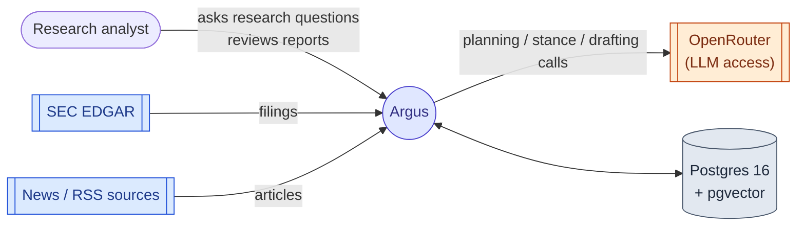
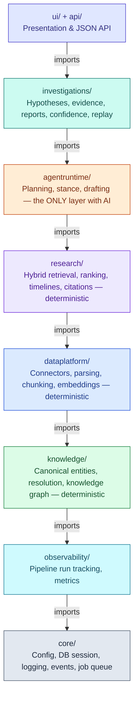
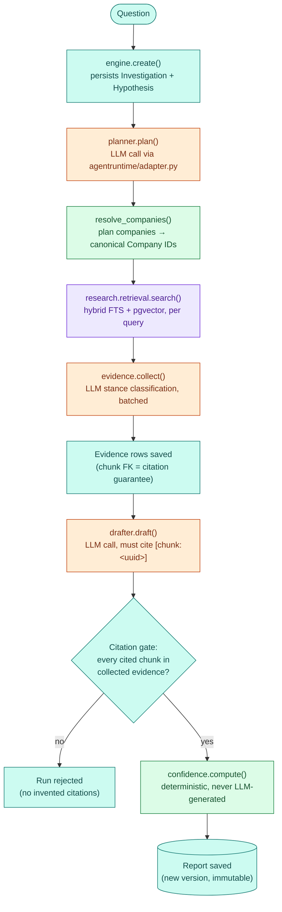
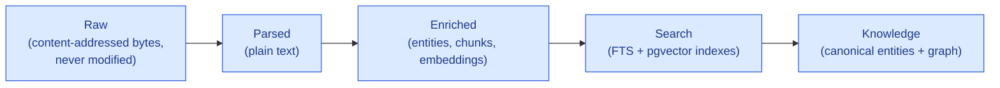
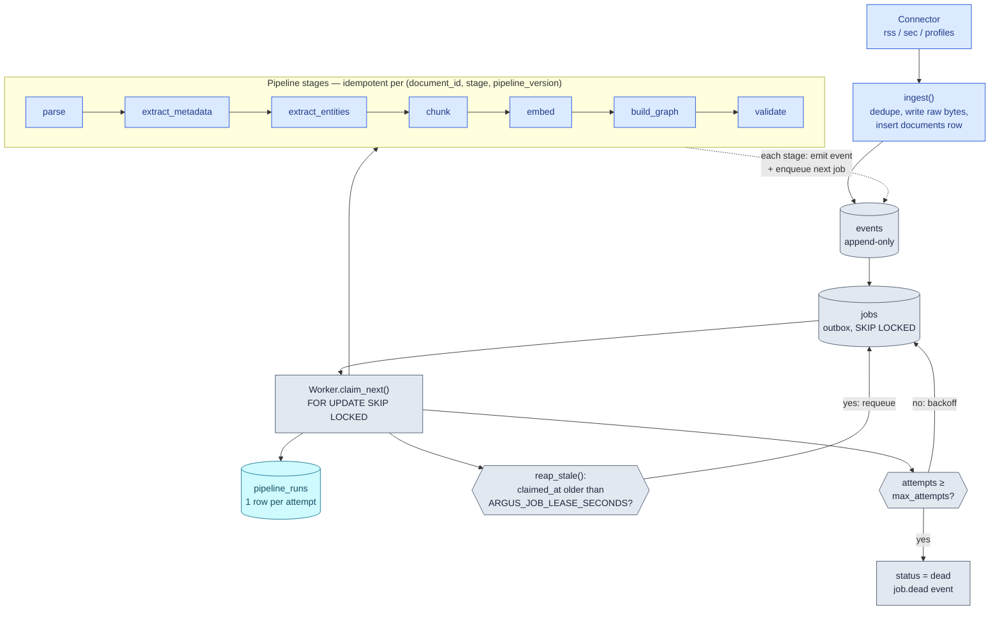
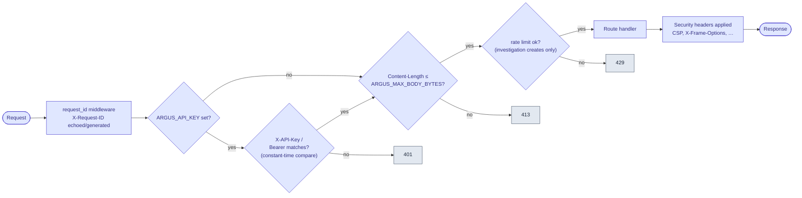

# Argus Architecture

Governing document: [DESIGN_BIBLE.md](DESIGN_BIBLE.md). Product scope: [PRD.md](PRD.md).
Schema shape: [DOMAIN_MODEL.md](DOMAIN_MODEL.md). Decisions and their tradeoffs live in
[adr/](adr/). New to the codebase? Start with [ONBOARDING.md](ONBOARDING.md) instead — this
document describes the system as built, in depth.

---

## System context



Argus sits between public sources and an analyst: it pulls filings and news in on a schedule,
stores everything in one Postgres instance, calls out to an LLM only for planning/drafting
(never for storage or retrieval), and hands back reports the analyst reviews.

## 1. Architecture style

Argus is a **modular monolith** ([ADR-0001](adr/0001-modular-monolith.md)): one deployable
Python application whose internal modules mirror the Design Bible's layers (§9) and communicate
through in-process interfaces. Enterprise modularity without distributed-systems overhead.

## 2. Layers



**Layer rule** (Bible §9): higher layers never bypass lower layers, and nothing at or below
the Research Engine imports AI code. Enforced with `import-linter`, not by convention.
One nuance: in *import* terms the Knowledge Platform sits below the Data Platform —
pipeline stages depend on the knowledge models and repositories they populate, never the
reverse. The Bible's diagram describes data flow (upward); the import contract describes
code dependency (downward onto the organization's memory). Similarly, `ui/` sits one
import layer above `api/` (views reuse the API's session dependency); `argus.main` is the
composition root that mounts both routers into one FastAPI app, and `argus.cli` the
entry point for worker/ingest commands — both live outside the layer stack.

## 3. The AI boundary

AI never owns the data pipeline (Bible §15). Documents flow through deterministic stages —
parse → metadata → entity extraction → chunk → embed → validate — before any agent can see
them. Agents consume the knowledge platform through the Research Engine's typed interfaces
and must attach chunk-level citations to every piece of evidence; uncited evidence is
rejected at the boundary ([ADR-0005](adr/0005-evidence-first-ai-boundary.md)).

### Investigation lifecycle

How a question becomes a cited, confidence-scored report (`investigations/engine.py`):



Orange steps are the only ones that call an LLM; everything else — retrieval, the citation
gate, and the confidence score — is deterministic and auditable.

## 4. Storage

One Postgres 16 instance serves every layer ([ADR-0002](adr/0002-postgres-for-everything.md)):

| Concern          | Mechanism                                                |
|------------------|----------------------------------------------------------|
| Documents & metadata | Relational tables; documents are immutable            |
| Raw bytes        | Content-addressed filesystem store (`data/raw/<sha256>`) |
| Embeddings       | `pgvector` (HNSW index)                                   |
| Keyword search   | Native FTS (`tsvector` + GIN)                             |
| Knowledge graph  | `graph_nodes` / `graph_edges` + recursive CTEs            |
| Eventing         | Append-only `events` table + `jobs` outbox (`SKIP LOCKED`)|

Each choice has a named upgrade path recorded in its ADR; the repository interfaces hide
storage so a swap (pgvector → dedicated vector DB, outbox → Kafka, CTEs → Neo4j) does not
ripple upward. This is how the design answers the Bible's 100-million-document test (§19).

Full entity-relationship shape of the schema (documents, chunks, companies, events, jobs,
investigations, evidence, reports, …) lives in [DOMAIN_MODEL.md](DOMAIN_MODEL.md) — this
section covers the storage mechanisms, that one covers the object shapes.

### Storage layers (Bible §14)



Raw documents are permanent and never modified; every derived artifact (chunks, embeddings,
entities, edges) references its source document, pipeline version, and timestamp, and can be
re-derived at any time via `argus reprocess` without re-downloading.

## 5. Event-driven ingestion

The append-only `events` table is the source of truth ([ADR-0003](adr/0003-events-and-outbox.md)).
Domain events (`document.ingested`, `document.parsed`, `document.enriched`, …) are appended
in the same transaction as the state change; `jobs` rows are derived from events (outbox
pattern) and claimed by the worker with `FOR UPDATE SKIP LOCKED`. Events are retained
forever, so every pipeline run is replayable. Stages are idempotent, keyed on
`(document_id, stage, pipeline_version)`.



Crash recovery: each claimed job carries a lease; the reaper re-queues jobs stuck `running`
past `ARGUS_JOB_LEASE_SECONDS` (default 600), since stages are idempotent and safe to re-run.
Jobs that exhaust `max_attempts` dead-letter (`status='dead'`, `job.dead` event) instead of
retrying forever; dead jobs are visible on the pipeline dashboard and requeued with
`argus retry-dead`.

## 6. Reproducibility

Every investigation persists its full execution history in `investigation_events`: prompts,
retrieval strategy + version, retrieved document IDs, embedding model version, LLM model
version. A future engineer can replay an investigation and obtain the same retrieval set.

## 7. Observability

Every pipeline stage writes a `pipeline_runs` row (duration, status, error, retry count).
Queue depth comes from `jobs`. Exposed at `/api/metrics/pipeline` (also fields
`oldest_pending_seconds`, `retries_24h`) and on the pipeline dashboard. Silent failures
are unacceptable (Bible §8); poison messages dead-letter visibly. Containerized deployments
run uvicorn with `--no-access-log` so container stdout stays pure JSON — our own structured
logs, not a second uncorrelated log format.

## 8. Security model

Security bar: internal network, single analyst ([ADR-0009](adr/0009-security-model-v1.md)).
One `request_context` middleware in `argus.main` carries the whole HTTP surface: optional
shared-key auth on `/api/*` (`ARGUS_API_KEY`, constant-time compare), request-ID
correlation into the JSON logs, security headers (self-only CSP — HTMX is vendored, not
CDN-loaded), a request-body size cap, and a per-IP rate limit on investigation creates
(the endpoint that spends LLM tokens). Below the API: LLM calls carry a timeout and
bounded retries; connector downloads are size-capped and SEC fetches allowlisted to
`*.sec.gov`; all SQL is parameterized with a server-side statement timeout; the raw store
is content-addressed so no external string ever becomes a filesystem path. Citations are
structurally validated against retrieved chunks and confidence is computed, which is the
real prompt-injection defense (RISKS.md #8). TLS terminates at a reverse proxy. Every
knob is an `ARGUS_` setting documented in `.env.example`.



## 9. Module map

```
src/argus/
├── core/            # settings, db session, JSON logging, event append + outbox queue
├── dataplatform/    # connectors/{profiles,sec,rss}, scheduler, stages/, embeddings provider
├── knowledge/       # repositories, entity resolution, canonical IDs, graph, indexes
├── research/        # hybrid retrieval (RRF), timelines, contradiction grouping, citations
├── agentruntime/    # adapter.py (only ADK import), planner, evidence collector, drafter
├── investigations/  # investigation engine, confidence math, reports, staleness detection
├── observability/   # pipeline_runs recording + status queries
├── api/             # FastAPI JSON routers
└── ui/              # Jinja2 + HTMX views (workspace, reports, explorer, dashboard)
```

## 10. Evaluation framework

`evals/golden.json` is a selector-based golden set (queries/expected entities, not fixed
document IDs), so it stays valid across corpus rebuilds. `argus eval retrieval` scores
hybrid retrieval (hit-rate, MRR); `argus eval investigation` scores citation-coverage and
stance-balance on existing reports. Both stamp an `eval_runs` row with the pipeline and
retrieval-strategy versions in force, so a score is always attributable to the code that
produced it. `make eval` runs both.

## 11. Deliberate exclusions

Deferred capabilities are decisions, not omissions; each is recorded in an ADR with the
trigger that would revisit it: Neo4j, Kafka/Redis Streams, dedicated vector DB, PDF/OCR,
ML-based NER, authentication/multi-user, React UI, streaming connectors, fully-automatic
investigation re-evaluation (V1 ships event-driven staleness detection + manual refresh).
