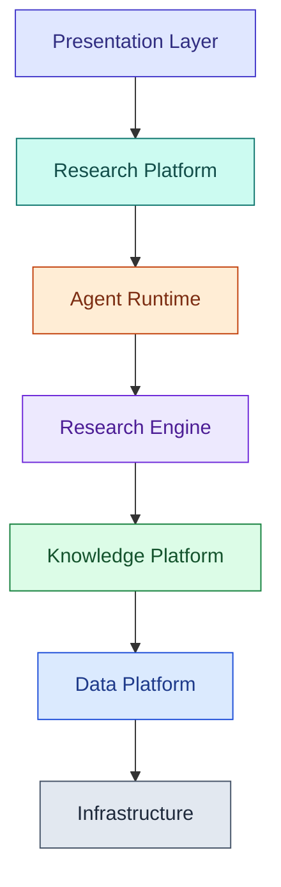

# ARGUS DESIGN BIBLE

## Version 0.1

### Principal Engineer Blueprint

---

# 1. Purpose

Argus is an Enterprise Research Operating System designed to demonstrate production-grade AI systems engineering for institutional investment research.

Argus is not intended to outperform commercial enterprise research platforms. Instead, it demonstrates the architectural thinking, engineering discipline, and systems design required to build such platforms.

The success metric of Argus is not prediction accuracy.

The success metric is whether experienced AI engineers recognize the engineering patterns used throughout the system.

---

# 2. Project Philosophy

Argus exists because enterprise AI is fundamentally a systems engineering problem rather than an LLM problem.

Large Language Models are one component within a much larger architecture consisting of:

* Data Engineering
* Knowledge Engineering
* Information Retrieval
* Entity Resolution
* Storage Systems
* Event Processing
* Observability
* Workflow Orchestration
* Evaluation
* Software Engineering

The knowledge platform is the permanent asset.

The AI runtime is replaceable.

---

# 3. Mission Statement

Build a production-minded research operating system that reflects how institutional investment organizations structure, ingest, organize, retrieve, and reason over enterprise knowledge.

---

# 4. Vision

Argus continuously ingests financial knowledge, transforms it into structured enterprise knowledge, and assists analysts through evidence-driven research workflows.

---

# 5. Non-Goals

Argus will never attempt to:

* Replace financial analysts.
* Execute trades.
* Predict stock prices.
* Provide investment advice.
* Compete with Bloomberg or FactSet.
* Maximize autonomous decision making.

---

# 6. Success Criteria

Argus succeeds if an experienced engineer can conclude:

* the architecture is modular
* the system is scalable
* the data model is realistic
* the workflows resemble institutional research
* the AI layer is isolated
* evidence is prioritized over generation
* engineering quality is visible throughout the repository

---

# 7. Core Principles

1. Knowledge First
2. Evidence First
3. Human First
4. Event Driven
5. Deterministic Infrastructure
6. Replaceable Intelligence
7. Explainability
8. Reproducibility
9. Scalability
10. Observability
11. Extensibility
12. Simplicity over Cleverness

---

# 8. Engineering Principles

Every pipeline should be idempotent.

Every connector should be independently testable.

Every document should be immutable.

Every event should be replayable.

Every AI output should include provenance.

Every processing stage should expose metrics.

Every architectural decision should support future scale.

Every module should have clear ownership and responsibilities.

---

# 9. Architectural Philosophy

Argus follows a layered architecture.

See [ARCHITECTURE.md §2](ARCHITECTURE.md#2-layers) for how this maps to actual package names
and the import-direction nuances (as built, one layer differs slightly from this conceptual
picture).

Each layer communicates through well-defined interfaces.

Higher layers never bypass lower layers.

---

# 10. Platform Layers

## Data Platform

Responsible for:

* Connectors
* Scheduling
* Parsing
* Metadata
* Chunking
* OCR
* Entity Extraction
* Embeddings
* Validation

No AI orchestration exists here.

Everything is deterministic.

---

## Knowledge Platform

Responsible for:

* Knowledge Graph
* Entity Resolution
* Canonical IDs
* Versioning
* Search Indexes
* Hybrid Retrieval
* Metadata
* Relationships

This layer represents the organization's memory.

---

## Research Engine

Responsible for:

* Search
* Evidence Collection
* Ranking
* Timeline Construction
* Contradiction Detection
* Citation Assembly

This layer transforms knowledge into research artifacts.

---

## Agent Runtime

Responsible for:

* Planning
* Workflow Orchestration
* Report Drafting
* User Interaction
* Recommendations

Current implementation target:

Google ADK.

The platform must remain framework-independent.

---

## Presentation Layer

Responsible for:

* Investigation Workspace
* Dashboards
* Reports
* Timelines
* Knowledge Explorer
* Search
* Notifications

The interface should resemble enterprise software rather than consumer chat applications.

---

# 11. Product Identity

Argus is a platform.

Not a chatbot.

Major engines include:

* Connector Framework
* Knowledge Engine
* Investigation Engine
* Retrieval Engine
* Citation Engine
* Graph Engine
* Research Engine
* Evaluation Engine
* Agent Runtime

---

# 12. Core Domain Model

Primary Object

Document

Secondary Objects

Company

Entity

Relationship

Investigation

Evidence

Hypothesis

Citation

Timeline Event

Research Report

Research Session

Connector

Derived Artifact

---

# 13. Investigations

The investigation is the primary product abstraction.

An investigation contains:

* research question
* hypothesis
* supporting evidence
* contradicting evidence
* retrieved documents
* timeline
* confidence
* citations
* notes
* follow-up questions
* generated reports
* execution history
* investigation state

Investigations are persistent and reproducible.

---

# 14. Data Philosophy

Raw data is permanent.

Processed data is reproducible.

Knowledge is versioned.

Derived artifacts are disposable.

Raw artifacts are never modified.

---

# 15. AI Philosophy

AI should never own the ingestion pipeline.

AI should never become the source of truth.

AI consumes structured knowledge.

AI produces hypotheses, summaries, plans, and reports.

AI outputs must remain explainable.

---

# 16. Retrieval Philosophy

Retrieval should combine multiple techniques rather than relying on vector search alone.

Expected capabilities include:

* lexical retrieval
* semantic retrieval
* metadata filtering
* graph traversal
* temporal retrieval
* entity-aware retrieval

Evidence quality is more important than embedding quality.

---

# 17. Evidence Philosophy

Every conclusion should answer:

What evidence supports this?

What evidence contradicts this?

What evidence is missing?

How reliable is the evidence?

When was it collected?

Can another engineer reproduce this conclusion?

---

# 18. Knowledge Graph Philosophy

Documents are not intelligence.

Relationships are intelligence.

Argus should progressively transform isolated documents into connected knowledge.

---

# 19. Scalability Philosophy

Every architectural decision should be evaluated against a hypothetical deployment containing at least one hundred million documents.

If the architecture would fail under that assumption, reconsider the design.

---

# 20. Documentation Philosophy

Documentation is treated as a production artifact.

The repository should be understandable before reading any source code.

Architecture should be discoverable through documentation.

Implementation should follow architecture rather than define it.

---

# 21. Repository Philosophy

The repository should communicate engineering maturity.

Someone reviewing Argus should see:

* intentional architecture
* disciplined software engineering
* production-oriented design
* realistic tradeoff analysis
* clear documentation
* thoughtful abstractions

before they see any implementation.

---

# 22. Long-Term Roadmap

Phase 1 — Product Definition

Phase 2 — Domain Modeling

Phase 3 — Data Platform

Phase 4 — Knowledge Platform

Phase 5 — Retrieval Engine

Phase 6 — Agent Runtime

Phase 7 — Investigation Platform

Phase 8 — Evaluation Framework

Phase 9 — Infrastructure

Phase 10 — Production Hardening

---

# 23. Living Document

This Design Bible is the governing architectural document for Argus.

Every Architecture Decision Record (ADR), pull request, feature proposal, and implementation should reference this document.

Whenever a design conflicts with the principles defined here, the conflict must be explicitly documented and justified.

The Design Bible evolves deliberately, but its principles remain stable.

Architecture leads implementation—not the other way around.
