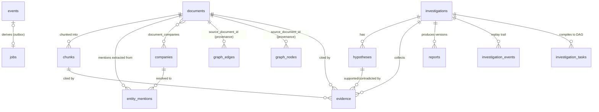

# Argus Domain Model

The Design Bible §12 objects, as implemented. Storage mapping is in `migrations/`; model
classes live in the owning layer's `models.py`. Two schema-level guards back the invariants:
a trigger rejects mutation of `documents` content columns, and a trigger rejects any
`UPDATE`/`DELETE` on `events`.

## Entity relationships

Relationship-only view — column-level detail is in the object catalog below and in the
migrations. `events`/`jobs` are infrastructure records (not part of the object catalog) but
are included here because every derived row above traces back to one.

## Object catalog

| Object | Owner (layer) | Table(s) | Lifecycle |
|---|---|---|---|
| **Document** | knowledge | `documents` | Ingested once, immutable forever. Only workflow `status` advances (`ingested → parsed → enriched → indexed`, or `failed`). Content is never edited; corrections arrive as new documents. |
| **Company** | knowledge | `companies` | Canonical entity. Seeded from the SEC ticker registry before any document ingestion; enriched over time. Canonical key: CIK (unique). |
| **Entity** | knowledge | `companies` (canonical), `entity_mentions` (occurrences) | V1's only canonical entity type is Company. A *mention* is an extracted occurrence in a document; *resolution* links mention → canonical company, stamped with `resolution_version`. |
| **Relationship** | knowledge | `graph_nodes`, `graph_edges` | Typed edge between nodes (company, sector, industry, …). Every edge carries `source_document_id` — relationships without provenance cannot exist (schema-enforced NOT NULL). |
| **Derived Artifact** | dataplatform/knowledge | `chunks`, `entity_mentions`, `graph_*` | Disposable and re-derivable from raw documents. Keyed by `pipeline_version`; reprocessing writes a new version, never mutates the old. |
| **Connector** | dataplatform | (code + `documents.source`) | Discovers and fetches raw documents. The framework owns dedupe (`(source, source_native_id)` unique, checksum), raw-store writes, and event emission. |
| **Investigation** | investigations | `investigations` (Phase 7) | Persistent research artifact: question → hypotheses → evidence → report. Versioned, linkable, archivable. Never a chat session. |
| **Hypothesis** | investigations | `hypotheses` (Phase 7) | Belongs to an investigation; accumulates supporting/contradicting evidence. |
| **Evidence** | investigations | `evidence` (Phase 7) | Links an investigation to a chunk with a stance (`supporting/contradicting/unknown`). Chunk reference is mandatory — uncited evidence is rejected (ADR-0005). |
| **Citation** | research | resolved from `evidence → chunks → documents` | Not stored separately: a citation is the traversal evidence → chunk → document → source URL, guaranteed resolvable by foreign keys. |
| **Timeline Event** | research | derived from `documents.published_at` + graph | Computed, not stored: entity-scoped documents/events ordered by publication time. |
| **Research Report** | investigations | `reports` (Phase 7) | Structured artifact (exec summary, findings, both stance sections, confidence breakdown, citations). Immutable once generated; regeneration creates a new version. |
| **Research Session** | investigations | `investigation_events` (Phase 7) | Append-only execution history: prompts, retrieval strategy + version, model versions, retrieved document IDs. The replay record. |
| **Investigation Task** | investigations | `investigation_tasks` (V2 Phase 1) | One DAG node compiled from the research plan: `task_type` (`collect_evidence` \| `synthesize`), `objective`, `depends_on` (prerequisite task UUIDs), `status` (`pending → running → complete \| failed \| obsolete`), `inputs`/`outputs`. Executed through the jobs outbox — `job.document_id` carries the investigation id, `job.payload` the task id (ADR-0010). |

## Infrastructure records (core / observability)

| Record | Table | Purpose |
|---|---|---|
| Domain event | `events` | Append-only source of truth (`document.ingested`, …), written transactionally with the state change. Ordering cursor = bigint identity. |
| Job | `jobs` | Outbox derived from events; claimed `FOR UPDATE SKIP LOCKED`; retries with backoff; `dead` status for poison messages. Disposable — rebuildable from `events`. |
| Pipeline run | `pipeline_runs` | One row per stage execution: duration, status, error, attempt. Feeds `/metrics/pipeline`. |

## Invariants

1. **Document immutability** — content columns cannot change after insert (DB trigger).
   `status`/`version` are workflow state and may advance.
2. **Event log append-only** — no UPDATE or DELETE, ever (DB trigger).
3. **Provenance is total** — every chunk references its document; every mention references
   document (and chunk); every graph edge references a source document; evidence references
   chunks. There is no orphaned knowledge.
4. **Derived artifacts are versioned** — `(document_id, …, pipeline_version)` unique keys;
   reprocessing is additive.
5. **Canonical IDs** — one company per CIK; mentions resolve to canonical IDs or stay
   unresolved (never to duplicates).
6. **Embedding provenance** — every embedded chunk records its embedding model + version.
7. **Task readiness is derived, never stored** — an `investigation_task` becomes eligible to
   run only when every id in its `depends_on` list resolves to a `complete` task; this is
   computed on read (`orchestrator._advance`, `run_task`) from the dependencies' live
   `status`, not cached on the row, so it cannot drift out of sync with reality.

## Deliberate V1 simplifications

- Entity types beyond Company (people, macro events, regions) are graph nodes without a
  canonical registry; a registry per type is added when a connector produces them at volume.
- Ticker→company uniqueness is enforced at resolution time, not by schema (tickers are
  reused across exchanges historically).
