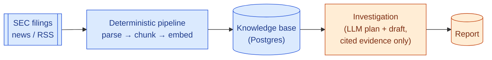

# Onboarding

Welcome to Argus. This doc gets you from clone to your first change without reading the
whole codebase first. Everything here links to the deeper docs — read those next.

## The 2-minute mental model

Argus pulls in financial documents (SEC filings, news) on a schedule, runs them through a
**deterministic** pipeline (parse → extract → chunk → embed) so nothing an AI generates ever
becomes the source of truth, and stores the result as a searchable, graph-linked knowledge
base in one Postgres database.

When an analyst asks a research question, an **investigation** is created: an LLM plans which
documents to look for, deterministic hybrid search retrieves them, an LLM drafts a report —
but every claim in that report must cite a real chunk of a real document, or the whole run is
rejected. Confidence in the report is a computed number (source diversity, recency, stance
agreement), never something the LLM says about itself.

Argus is **not** a chatbot and investigations are **not** chat sessions — they're persistent,
versioned, replayable artifacts. See [DESIGN_BIBLE.md](DESIGN_BIBLE.md) for why that
distinction matters to the whole design.



## Setup, narrated

Prerequisites: Python 3.12+, [uv](https://docs.astral.sh/uv/), Docker.

```bash
cp .env.example .env      # defaults work as-is for local dev; auth/rate-limit are opt-in
make up                   # starts Postgres 16 + pgvector, waits for healthy
make migrate              # applies migrations (hand-written, in migrations/)
make test                 # full suite should pass with zero config beyond the above
make api                  # FastAPI + UI at http://localhost:8000, --reload
make worker               # separate terminal: pipeline worker + connector scheduler
```

`ARGUS_OPENROUTER_API_KEY` is unset by default — everything runs and tests pass against a
deterministic fake LLM adapter. You only need a real key to see live investigation runs
against an actual model (`ARGUS_LLM_MODEL`, default `google/gemini-2.5-flash`).

**Common snag:** if `make up` fails to bind port 5432, something else on your machine
(another local Postgres) already owns it. Either stop that service, or add a
`docker-compose.override.yml` remapping the `postgres` service to a free host port and update
`ARGUS_DATABASE_URL` in `.env` to match.

## Guided tour: follow one document through the system

Trace a single RSS article end to end — every step below is one function call, in order:

1. `dataplatform/worker.py` ticks the RSS connector on schedule → `connectors/rss.py`
   `discover()` finds a new article URL.
2. `connectors/base.py` `ingest()` fetches the bytes (size-capped), dedupes against
   existing documents, writes raw bytes content-addressed to `data/raw/<sha256>`, inserts an
   immutable `documents` row, and — in the same transaction — appends a `document.ingested`
   event and enqueues a `parse` job (`core/events.py` `emit()`).
3. `dataplatform/worker.py` `claim_next()` picks up the job (`FOR UPDATE SKIP LOCKED`) and
   runs `dataplatform/pipeline.py`'s `parse` stage, which strips HTML and writes plain text.
   Each stage finishing emits an event and enqueues the *next* stage's job — that's the whole
   pipeline: `parse → extract_metadata → extract_entities → chunk → embed → build_graph →
   validate`.
4. `chunk` splits the text into ~250-word `chunks` rows; `embed` runs them through fastembed
   and stores the vector on each chunk; `extract_entities` matches company names/tickers and
   links the document to `companies`; `build_graph` adds `co_mentioned` edges.
5. Once `validate` passes, the document is `status="enriched"` — now retrievable.
6. Later, an investigation's `research/retrieval.py` `search()` finds this document's chunks
   via hybrid full-text + vector search, `agentruntime/evidence.py` classifies their stance,
   and if the drafter cites one of them, it shows up in a report with a working citation link
   back to this exact chunk.

The full diagram for this (plus the reaper/dead-letter paths) is in
[ARCHITECTURE.md §5](ARCHITECTURE.md#5-event-driven-ingestion); the investigation half is in
[ARCHITECTURE.md §3](ARCHITECTURE.md#3-the-ai-boundary).

## Where do I make change X?

Import direction is one-way and enforced by `make lint` (`import-linter`) — never import
"up" the list below.

| I want to... | Layer / file |
|---|---|
| Add a new document source | `dataplatform/connectors/` — new module implementing `discover()`/`fetch()`, subclass the pattern in `rss.py` or `sec.py` |
| Add or change a pipeline stage | `dataplatform/pipeline.py` — keep it idempotent, keyed on `(document_id, stage, pipeline_version)` |
| Change entity resolution / the knowledge graph | `knowledge/graph.py`, `knowledge/repositories.py` |
| Change retrieval ranking | `research/retrieval.py` (`STRATEGY_VERSION` — bump it if the algorithm changes, scores become incomparable across versions) |
| Change how confidence is scored | `investigations/confidence.py` — must stay deterministic, never call an LLM here |
| Change what the agent plans/drafts, or swap models | `agentruntime/planner.py` / `drafter.py` / `.env`'s `ARGUS_LLM_MODEL` — never touch ADK outside `agentruntime/adapter.py` |
| Add an API endpoint | `api/routes.py` |
| Add a UI page | `ui/views.py` + a Jinja2 template |
| Add a new tunable | `core/config.py`'s `Settings`, prefixed `ARGUS_`, documented in `.env.example` |

## Glossary

| Term | Meaning |
|---|---|
| **Event** | An append-only, never-mutated row in `events` — the source of truth for everything that happened. |
| **Job** | A row in `jobs`, the disposable "outbox" queue derived from events; workers claim and process these. |
| **Chunk** | A ~250-word slice of a document's text with its own embedding — the smallest citable unit. |
| **Citation** | Not a stored object — it's the traversal `evidence → chunk → document → source URL`, always resolvable. |
| **Stance** | An LLM's classification of a chunk relative to a hypothesis: `supporting` / `contradicting` / `unknown`. |
| **Confidence score** | A deterministic 0–1 score computed from source diversity, document count, source quality, recency, and stance agreement — never LLM output. |
| **Investigation** | A persistent, versioned research artifact (question → plan → evidence → report). Not a chat session. |
| **Pipeline version** | A stamp on every derived artifact; bump `ARGUS_PIPELINE_VERSION` and re-run `argus reprocess` to regenerate everything without re-fetching. |

## Keep reading

1. This doc → 2. [ARCHITECTURE.md](ARCHITECTURE.md) (system as built, with diagrams) →
3. [DOMAIN_MODEL.md](DOMAIN_MODEL.md) (schema shape) → 4. whichever [ADR](adr/) covers the
area you're touching → 5. [DESIGN_BIBLE.md](DESIGN_BIBLE.md) / [PRD.md](PRD.md) for the
"why" behind it all, whenever you want the deeper background.
