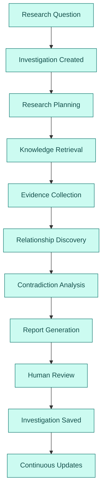

# Product Requirements Document (PRD)

# Argus — Enterprise Research Operating System

**Version:** 0.1 (Foundational Draft)

> **V2 scope lives in [PRD-V2.md](PRD-V2.md)** (Research Execution Engine: investigation
> planning, task DAGs, knowledge intelligence, specialist agents). This document remains
> the V1 foundation it was built against. Execution mapping: ADR-0010/0011/0012 and
> `superpowers/specs/2026-07-06-v2-research-execution-engine-design.md`.

---

# 1. Executive Summary

Argus is an Enterprise Research Operating System (EROS) designed to assist institutional investment teams in conducting evidence-based financial research.

Argus continuously ingests financial information from multiple structured and unstructured sources, transforms raw information into structured organizational knowledge, and enables analysts to conduct reproducible investigations through an AI-assisted research workflow.

Argus is **not** an investment advisor or trading system. Instead, it serves as a knowledge infrastructure platform that augments analysts by organizing enterprise knowledge, surfacing relevant evidence, maintaining provenance, and generating structured research artifacts.

The system is designed around the philosophy that **knowledge infrastructure is more valuable than AI generation**. Artificial intelligence synthesizes and explains knowledge, but never replaces the underlying evidence.

---

# 2. Problem Statement

Institutional investment research requires analysts to continuously consume and synthesize information from a large number of heterogeneous sources.

Typical sources include:

* SEC filings
* Earnings call transcripts
* Financial news
* Company announcements
* Macroeconomic reports
* Internal research notes
* Proprietary enterprise datasets
* Alternative data providers

These sources differ in format, structure, update frequency, reliability, and accessibility.

Existing workflows often involve manually switching between multiple tools, searching disconnected repositories, and reconstructing historical context across numerous documents. As the volume of available information grows, maintaining situational awareness becomes increasingly difficult.

Argus addresses this challenge by transforming fragmented information into a unified, structured, searchable knowledge platform.

---

# 3. Vision

To build a production-minded Enterprise Research Operating System that demonstrates how modern AI systems should organize, retrieve, and reason over institutional knowledge while remaining grounded in verifiable evidence.

---

# 4. Mission

Enable institutional research teams to create, maintain, and evolve evidence-backed investigations using structured enterprise knowledge rather than isolated document retrieval.

---

# 5. Product Goals

Argus aims to:

* Continuously ingest financial knowledge from multiple public sources.
* Build a canonical enterprise knowledge base.
* Support evidence-driven research investigations.
* Maintain complete provenance for every generated insight.
* Enable reproducible research workflows.
* Surface both supporting and contradictory evidence.
* Preserve historical context through temporal knowledge.
* Demonstrate production-quality AI systems engineering.

---

# 6. Non-Goals

Argus will not:

* Execute financial trades.
* Recommend investments.
* Predict market prices.
* Replace financial analysts.
* Compete directly with Bloomberg, FactSet, or Capital IQ.
* Optimize portfolios.
* Perform quantitative trading strategies.
* Generate unsupported conclusions.

---

# 7. Target Users

## Primary Users

### Portfolio Managers

Responsible for evaluating investment opportunities using evidence collected across multiple domains.

Needs:

* Rapid access to supporting evidence.
* High-level research summaries.
* Confidence assessments.
* Traceable citations.

---

### Research Analysts

Responsible for conducting detailed investigations.

Needs:

* Deep document search.
* Historical context.
* Investigation workspaces.
* Timeline reconstruction.
* Entity relationships.
* Research persistence.

---

### Sector Specialists

Responsible for monitoring industries and companies.

Needs:

* Continuous updates.
* Knowledge evolution.
* Cross-company relationships.
* Event tracking.

---

### Risk Teams

Responsible for identifying exposure and monitoring uncertainty.

Needs:

* Contradictory evidence.
* Source reliability.
* Confidence evolution.
* Historical investigations.

---

# 8. Product Philosophy

Argus is founded upon four guiding principles.

## Knowledge First

Knowledge is the primary asset.

Documents are raw material.

---

## Evidence First

Every conclusion must reference supporting evidence.

Generated text is never considered a source of truth.

---

## Human First

Analysts remain responsible for decisions.

AI accelerates research but never replaces human judgment.

---

## Evolution First

Knowledge changes continuously.

The system should evolve as new information arrives.

---

# 9. Core Product Concepts

The product revolves around persistent Investigations.

Investigations contain:

* Research Question
* Hypothesis
* Evidence
* Reports
* Timeline
* Notes
* Citations
* Confidence
* Version History

Investigations are the primary product abstraction.

Chat conversations are not.

---

# 10. Primary User Journey

A typical investigation follows the lifecycle below.

See [ARCHITECTURE.md's investigation lifecycle diagram](ARCHITECTURE.md#3-the-ai-boundary)
for how this maps to the as-built implementation.

---

# 11. Functional Requirements

## Investigation Management

The system shall:

* Create investigations.
* Save investigations.
* Reopen investigations.
* Version investigations.
* Link investigations.
* Archive investigations.

---

## Knowledge Retrieval

The system shall:

* Search documents.
* Search companies.
* Search entities.
* Search relationships.
* Search historical knowledge.
* Search timelines.

---

## Research Planning

The system shall:

* Interpret research questions.
* Identify target entities.
* Select relevant document types.
* Produce a retrieval strategy.
* Execute retrieval plans.

---

## Evidence Management

The system shall:

* Rank evidence.
* Classify supporting evidence.
* Classify contradictory evidence.
* Preserve citations.
* Track confidence.
* Preserve provenance.

---

## Report Generation

The system shall generate structured research reports containing:

* Executive Summary
* Research Question
* Hypothesis
* Key Findings
* Supporting Evidence
* Contradictory Evidence
* Timeline
* Risks
* Confidence
* Citations
* Sources
* Suggested Follow-up Questions

---

## Knowledge Evolution

The system shall:

* Detect newly ingested information.
* Update affected investigations.
* Recalculate confidence.
* Notify users of meaningful changes.

---

# 12. MVP Scope

Version 1 focuses on demonstrating the architecture rather than maximizing feature count.

Included:

* Public financial data ingestion.
* Investigation workspaces.
* Hybrid retrieval.
* Knowledge graph integration.
* Structured report generation.
* Citation engine.
* Temporal knowledge.
* Versioned investigations.
* Evidence classification.
* Google ADK orchestration.

Excluded:

* Collaboration.
* Permissions.
* Proprietary enterprise connectors.
* Real-time streaming.
* Portfolio optimization.
* Multi-user organizations.
* Fine-grained authorization.

---

# 13. User Experience Principles

The interface should resemble enterprise research software.

Avoid consumer AI patterns.

Prefer:

* Workspaces.
* Dashboards.
* Investigations.
* Reports.
* Timelines.
* Evidence tables.
* Knowledge explorers.

Avoid chat-first experiences.

Chat is a capability.

Investigations are the product.

---

# 14. Success Metrics

The primary objective is engineering quality.

Success is measured by:

* Reproducible investigations.
* Complete provenance.
* Retrieval relevance.
* Citation accuracy.
* Knowledge freshness.
* Modular architecture.
* Clear documentation.
* Demonstrable scalability.

Secondary metrics include:

* Investigation completion time.
* Report generation latency.
* Evidence coverage.
* Retrieval precision.
* Retrieval recall.

---

# 15. Risks

Potential risks include:

* Poor entity resolution.
* Weak retrieval quality.
* Hallucinated summaries.
* Incomplete provenance.
* Connector instability.
* Knowledge graph inconsistency.
* Data freshness issues.

Each risk should have mitigation strategies documented during technical design.

See [RISKS.md](RISKS.md) for the mitigation register.

---

# 16. Future Roadmap

Future versions may introduce:

* Proprietary enterprise connectors.
* Organization workspaces.
* Collaborative investigations.
* Watchlists.
* Continuous monitoring.
* Alerting.
* Portfolio impact analysis.
* Risk engines.
* Market intelligence engines.
* Alternative data pipelines.
* Multi-tenant deployments.

---

# 17. Product Success Statement

Argus succeeds when an experienced AI engineer or software engineer concludes:

> "This system demonstrates a strong understanding of how institutional research platforms should be architected. The engineering decisions are deliberate, the workflows are realistic, and the platform is designed with production-quality principles rather than as a simple AI demo."

That—not feature count—is the primary objective of Argus.
